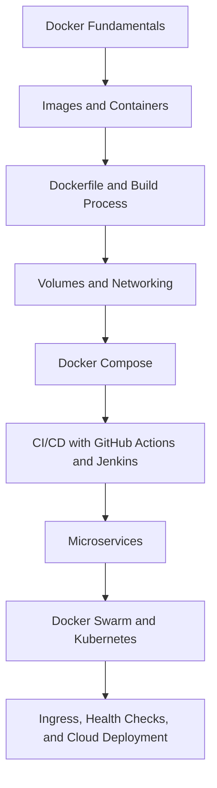

# 🐳 Docker Containers Course

<div align="center">


**A structured, hands-on course repository for learning Docker, containerization, CI/CD, microservices, and container orchestration.**

[Course Index](#-course-index) • [Learning Outcomes](#-learning-outcomes) • [Quick Start](#-quick-start) • [Lab Workflow](#-recommended-lab-workflow) • [Question Bank](#-question-bank)

</div>

---

## 📌 About This Repository

This repository is designed as a **course companion for Docker Containers and Container Orchestration**. It introduces learners to container fundamentals, Docker architecture, Dockerfiles, images, containers, volumes, networking, Docker Compose, CI/CD pipelines, microservices, Docker Swarm, Kubernetes, service discovery, ingress, health checks, and cloud deployment concepts.

The content is organized unit-wise so that students can move from **basic container concepts** to **real-world DevOps and orchestration workflows** through theory notes, examples, labs, and assessment material.

---

## 🎯 Learning Outcomes

By completing this course repository, learners should be able to:

- Explain the difference between **containers and virtual machines**.
- Understand the core components of **Docker architecture**.
- Build and run Docker containers using images, Dockerfiles, ports, volumes, and networks.
- Create Dockerized Python and Streamlit applications.
- Use Docker Compose for multi-container applications.
- Understand image layers, tags, registries, and Docker Hub workflows.
- Integrate Docker with CI/CD workflows using GitHub Actions and Jenkins.
- Explain microservices deployment patterns using containers.
- Understand the role of orchestration tools such as Docker Swarm and Kubernetes.
- Work with Kubernetes concepts such as Pods, Nodes, Control Plane, Services, Ingress, and health checks.
- Analyze container failure recovery and repair workflows.

---

## 🧭 Course Index

| Unit | Focus Area | What You Will Learn |
|---|---|---|
| [Unit 1](#-unit-1--docker-fundamentals) | Docker Fundamentals | Docker basics, architecture, containers vs VMs, developer benefits |
| [Unit 2](#-unit-2--docker-practical-workflows) | Docker Practical Workflows | Docker commands, Dockerfile, Compose, networking, volumes, CI/CD labs |
| [Unit 3](#-unit-3--orchestration-and-manageability) | Orchestration and Manageability | Kubernetes, Swarm, service discovery, automation, YAML, planning tools |
| [Unit 4](#-unit-4--advanced-container-and-cloud-workflows) | Advanced Container and Cloud Workflows | Docker Bake, public/private cloud, ingress, health checks, repair activity |
| [Question Bank](#-question-bank) | Assessment | MCQs and practice questions |

---

## 📚 Unit 1 — Docker Fundamentals

| Topic | Link |
|---|---|
| What is Docker? | [Open](Unit1/Lecture1.md#what-is-docker) |
| Docker Architecture | [Open](Unit1/Lecture1.md#docker-architecture) |
| Docker Engine | [Open](Unit1/Lecture1.md#docker-engine) |
| Docker Images | [Open](Unit1/Lecture1.md#docker-images) |
| Docker Containers | [Open](Unit1/Lecture1.md#docker-containers) |
| Docker Registries | [Open](Unit1/Lecture1.md#docker-registries) |
| Docker Network | [Open](Unit1/Lecture1.md#docker-network) |
| Docker Volumes | [Open](Unit1/Lecture1.md#docker-volumes) |
| How Docker Works | [Open](Unit1/Lecture1.md#how-docker-works) |
| Docker Architecture Diagram | [Open](Unit1/Lecture1.md#docker-architecture-diagram) |
| What Docker Is Not | [Open](Unit1/Lecture1.md#what-docker-isnt) |
| Docker vs Virtual Machine | [Open](Unit1/Lecture1.md#is-docker-a-virtual-machine) |
| How Docker Helps Developers | [Open](Unit1/Lecture1.md#how-does-docker-help-developers) |
| Development and Deployment Burdens | [Open](Unit1/Lecture1.md#development-and-deployment-burdens) |
| Why Organizations Use Docker Containers | [Open](Unit1/Lecture1.md#why-organizations-embrace-docker-containers) |

---

## 🛠️ Unit 2 — Docker Practical Workflows

| Topic | Link |
|---|---|
| CI/CD Using GitHub Pages Action | [Open](Unit2/CI_CD_Using_Github_Pages_Action.md) |
| Configure Jenkins with GitHub | [Open](Unit2/Configure_Jenkins_Github.md) |
| Docker Commands Cheat Sheet | [Open](Unit2/Docker_Commands_Cheat_Sheet.md) |
| DockerHub Tags | [Open](Unit2/Docker_Docekrhub_Tags.md) |
| Docker Compose | [Open](Unit2/Docker_DockerCompose.md) |
| Dockerfile | [Open](Unit2/Docker_Dockerfile.md) |
| Dockerfile Examples for Backend | [Open](Unit2/Docker_File_Examples_For_Backend.md) |
| Dockerfile Examples for Frontend | [Open](Unit2/Docker_file_examples_for_front_ends.md) |
| Dockerfile Examples for Popular Databases | [Open](Unit2/Docker_File_Example_For_Popular_DB.md) |
| Docker Layers | [Open](Unit2/Docker_Layers.md) |
| Docker Microservices | [Open](Unit2/Docker_Microservices.md) |
| Docker Networking | [Open](Unit2/Docker_Networking.md) |
| Docker Volumes | [Open](Unit2/Docker_Volume.md) |
| Lab Configuration Setup | [Open](Unit2/Lab_Configuration_Setup.md) |
| Lab: Create a Python Container | [Open](Unit2/Lab_Create_Python_Container.md) |
| Lab: Create a Python Streamlit Container | [Open](Unit2/Lab_Create_Python_Streamlit.md) |
| Popular Networking Ports and Protocols | [Open](Unit2/What_are_popular_networking_ports_and_protocol.md) |
| Webhooks in Docker Context | [Open](Unit2/What_ebhooks_services_explain_there_role_in_context_of_docker_containers.md) |
| Workflow in CI/CD | [Open](Unit2/What_is_workflow_in_CI_CD.md) |

---

## ⚙️ Unit 3 — Orchestration and Manageability

| Topic | Link |
|---|---|
| API Discovery and Translation | [Open](Unit3/API_discovery_and_translation.md) |
| Automation vs Orchestration | [Open](Unit3/Automation_VS_Orchestrations.md) |
| Configuration Management Tools | [Open](Unit3/Configuration_Managment_Tools.md) |
| Essential Characteristics for Manageability | [Open](Unit3/Essential_characteristics_for_manageability.md) |
| Functionality of Container Orchestration | [Open](Unit3/Functionality_of_Container_Orchestrisation.md) |
| Kubernetes and IBM | [Open](Unit3/Kubernetes_and_IBM.md) |
| Kubernetes Orchestration | [Open](Unit3/Kubernetes_Orchestrisation.md) |
| Life of a Request | [Open](Unit3/Life_of_a_request.md) |
| Microservices Orchestration Example | [Open](Unit3/Microservices_Orchasterisation_Example.md) |
| Microservice Orchestration with Docker Swarm | [Open](Unit3/Microservice_Orchasterisation_Docker_Swarm.md) |
| Minikube and Kubectl | [Open](Unit3/Minikube_Kubectil.md) |
| Planning Tools | [Open](Unit3/Planning_Tools.md) |
| Popular Docker Orchestration Tools: Kubernetes | [Open](Unit3/Popular_tools_Docker_Orchestrisation_Kubernetes.md) |
| Service Discovery Tools | [Open](Unit3/Service_Discovery_Tools.md) |
| Understanding YAML Files | [Open](Unit3/Understanding_YAML_File.md) |
| YAML Use Case | [Open](Unit3/Yaml_USE_Case.md) |
| Python YAML Use Case | [Open](Unit3/Python_Yaml_Use_Case.md) |
| SQLite, Python, and YAML | [Open](Unit3/Sqlite_Python_Yaml.md) |

---

## ☁️ Unit 4 — Advanced Container and Cloud Workflows

| Topic | Link |
|---|---|
| Docker Bake Interaction | [Open](Unit4/Backery_Interaction.md) |
| Docker Bake Foundations | [Open](Unit4/Bakery_Fondations.md) |
| Docker Bake Foundation Example | [Open](Unit4/Bakery_Foundation_Example.md) |
| Cluster on Public Cloud | [Open](Unit4/Cluster_on_public_cloud.md) |
| Docker Bake | [Open](Unit4/Docker_Bake.md) |
| Health Check and Repair Activity | [Open](Unit4/Health_check_and_repair_activity.md) |
| Private Cloud: Exposing Services via Ingress | [Open](Unit4/Private_cloud-exposing_services_via%20_Ingress.md) |

---

## 🧪 Recommended Lab Workflow

For every practical lab, students should follow this workflow:

```text
1. Read the concept note.
2. Identify the Docker/Kubernetes commands used.
3. Create a clean project folder.
4. Write or modify the Dockerfile / compose file / YAML file.
5. Build and run the container or deployment.
6. Capture terminal output and screenshots.
7. Explain what happened in your own words.
8. Push your completed work to GitHub.
```

Suggested submission format:

```text
Name:
Roll Number:
Unit:
Lab Title:
Objective:
Commands Used:
Output Screenshot:
Errors Faced:
Solution Applied:
Learning Summary:
GitHub Link:
```

---

## 🚀 Quick Start

### 1. Clone the Repository

```bash
git clone https://github.com/vibhug0077/Docker_Containers.git
cd Docker_Containers
```

### 2. Verify Docker Installation

```bash
docker --version
docker compose version
```

### 3. Run a Basic Test Container

```bash
docker run hello-world
```

### 4. Open the Course Material

Start with:

```text
Unit1/Lecture1.md
```

Then move unit-wise through the repository.

---

## 💻 Recommended Software Setup

| Tool | Purpose |
|---|---|
| Docker Desktop / Docker Engine | Running containers |
| Git | Version control and GitHub workflow |
| VS Code | Code editing and Markdown preview |
| WSL2 / Linux Terminal | Command-line practice |
| Python 3.x | Python container examples |
| GitHub Account | Repository submission and CI/CD practice |
| Minikube / Kind | Local Kubernetes practice |
| kubectl | Kubernetes command-line tool |

---

## 🧱 Suggested Learning Path



---

## 📝 Question Bank

| Section | Link |
|---|---|
| MCQ Question Bank — Section A | [Open](Question_Bank/Question_Bank_SectionA.md) |
| MCQ Question Bank — Section B | [Open](Question_Bank/Questions_Bank_SectionB.md) |

---

## 📊 Assessment Suggestions

| Component | Weightage | Description |
|---|---:|---|
| Lab Assignments | 40% | Docker commands, Dockerfile, Compose, networking, volumes, Kubernetes basics |
| Viva / Oral Evaluation | 20% | Conceptual understanding and command explanation |
| Mini Project | 25% | Containerized application with documentation |
| MCQ / Written Test | 15% | Docker, CI/CD, orchestration, and Kubernetes concepts |

---

## 🧩 Mini Project Ideas

Students can extend the course with one of the following mini projects:

- Dockerize a Python Flask application.
- Dockerize a Streamlit machine learning dashboard.
- Create a multi-container app using Docker Compose.
- Build a frontend + backend + database stack.
- Configure a CI/CD pipeline using GitHub Actions.
- Deploy a simple containerized app on Kubernetes using Minikube.
- Create a health-check enabled service and observe restart behavior.
- Compare Docker Compose, Docker Swarm, and Kubernetes for the same application.

---

## ✅ Best Practices for Students

- Use meaningful names for images, containers, networks, and volumes.
- Keep Dockerfiles small and readable.
- Use `.dockerignore` to reduce image build context.
- Prefer official base images where possible.
- Avoid hardcoding secrets in Dockerfiles or YAML files.
- Document every command you run.
- Clean unused containers, images, and volumes regularly.
- Push practical work to GitHub with clear commit messages.

---

## 🧹 Useful Docker Cleanup Commands

```bash
# Stop all running containers
docker stop $(docker ps -q)

# Remove all stopped containers
docker container prune

# Remove unused images
docker image prune

# Remove unused volumes
docker volume prune

# Remove unused networks
docker network prune

# Full cleanup of unused Docker objects
docker system prune -a
```

> Use cleanup commands carefully. Some commands permanently remove unused Docker resources.

---

## 📖 Official References

- [Docker Documentation](https://docs.docker.com/)
- [Dockerfile Reference](https://docs.docker.com/reference/dockerfile/)
- [Docker Compose Documentation](https://docs.docker.com/compose/)
- [Kubernetes Documentation](https://kubernetes.io/docs/)
- [GitHub Actions Documentation](https://docs.github.com/actions)
- [Jenkins Documentation](https://www.jenkins.io/doc/)

---

## 👨‍🏫 Instructor Note

This repository is intended to support classroom teaching, hands-on lab sessions, student self-practice, and assessment preparation. Learners are encouraged to not only read the notes but also execute the commands, break things intentionally, debug errors, and document their observations.

> Containers are best learned by building, running, failing, debugging, and rebuilding.

---

## 🤝 Contributions

Students and contributors may improve this repository by:

- Fixing typos and broken links.
- Adding command outputs and screenshots.
- Adding more Dockerfile examples.
- Improving lab instructions.
- Creating new mini projects.
- Adding Kubernetes YAML examples.
- Expanding the question bank.

Recommended contribution workflow:

```bash
git checkout -b improve-docker-course
# make changes
git add .
git commit -m "Improve Docker course documentation"
git push origin improve-docker-course
```

---

## ⭐ Repository

If this repository helps you learn Docker and container orchestration, consider starring it on GitHub.

```text
Build once. Run anywhere. Scale intelligently.
```

</div>
